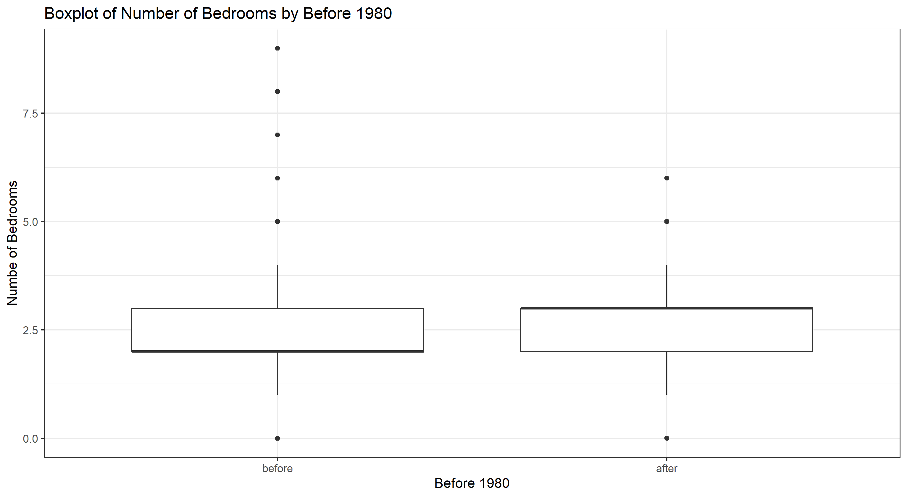
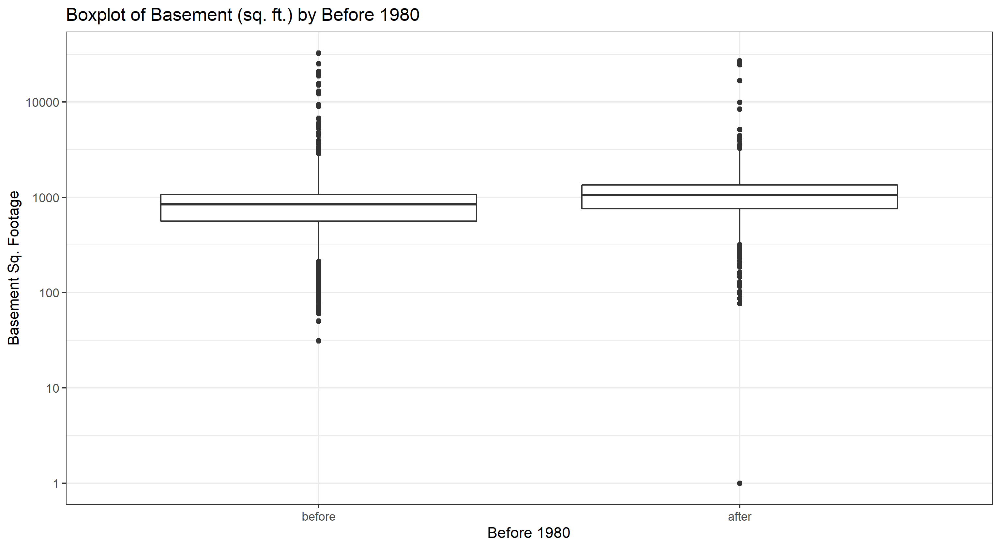
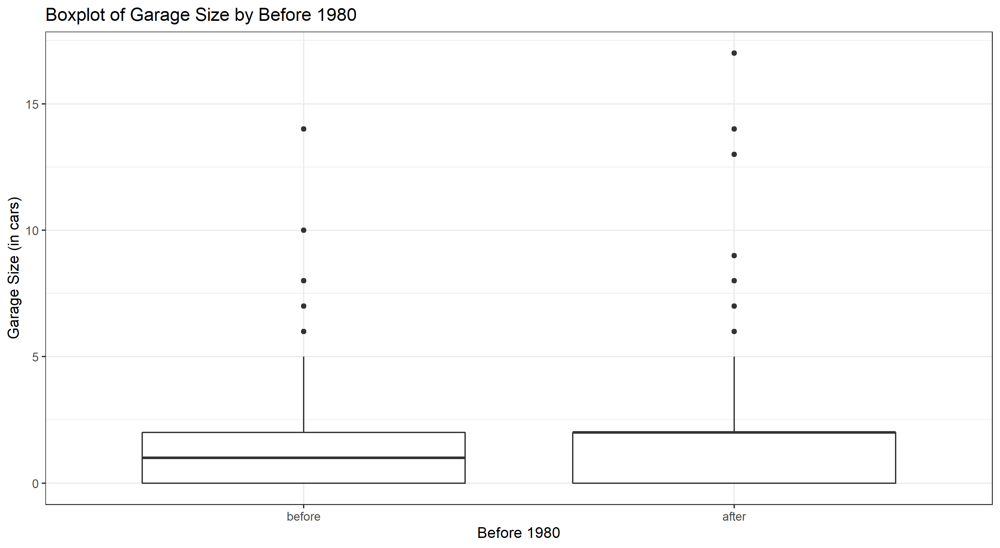
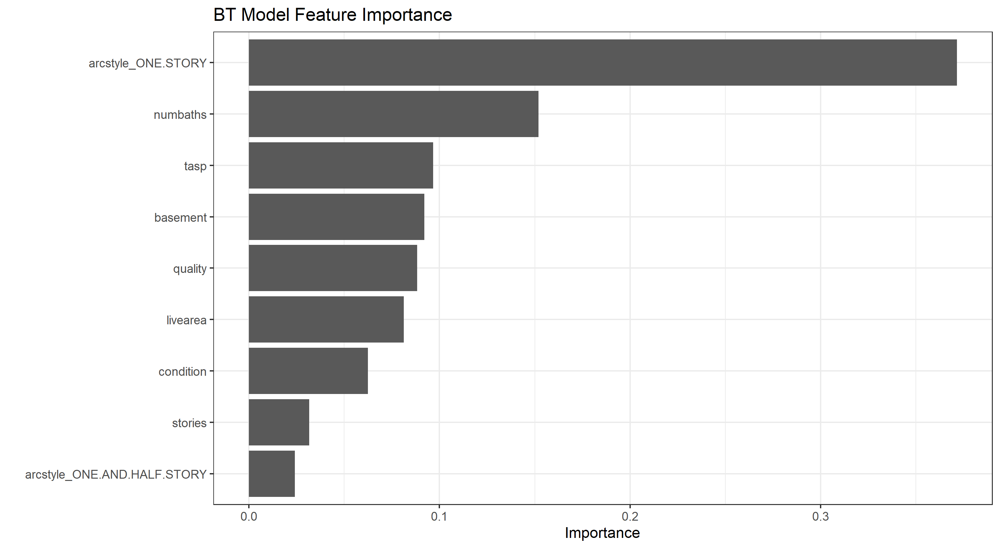
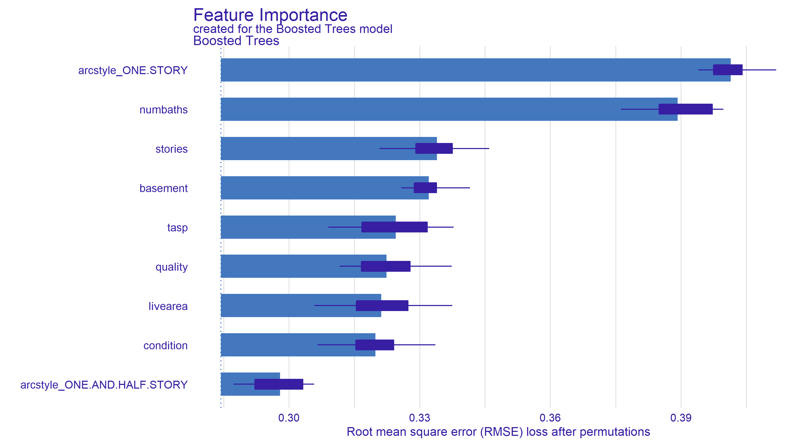
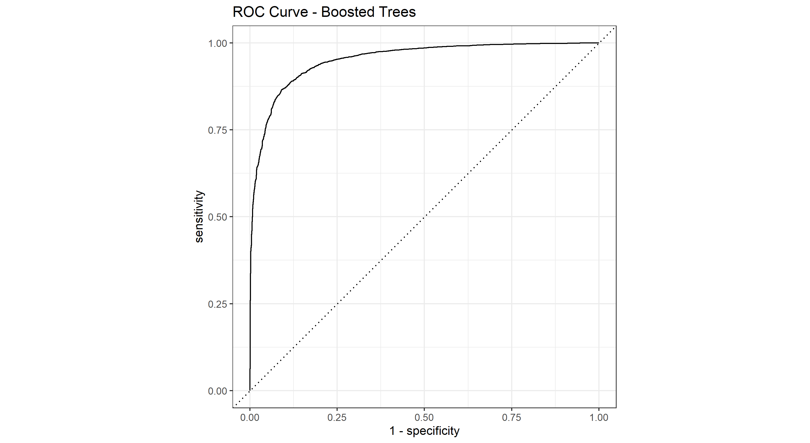

# Project 4: Making predictions

The clean air act of 1970 was the beginning of the end for asbestos in homebuilding. By 1976, the U.S. Environmental Protection Agency (EPA) was given authority to restrict asbestos in paint. Homes built during and before this period are known to have materials with asbestos https://www.asbestos.com/mesothelioma-lawyer/legislation/ban/.

The state of Colorado has a large portion of their residential dwelling data that is missing the year built, and they would like you to create a predictive model that can classify if a house is built pre 1980. They would also like you to create a model that predicts (regression) the actual age of each home.

Colorado gave you home sales data for the [city of Denver from 2013](https://www.denvergov.org/opendata/dataset/city-and-county-of-denver-real-property-sales-book-2013) on which to train your model. They said all the column names should be descriptive enough for your modeling and that they would like you to use the latest machine learning methods.

## Readings

- [Machine Learning Overview](https://byuistats.github.io/CSE250-Hathaway/course-materials/machine-learning/)
- [A visual introduction to machine learning](http://www.r2d3.us/visual-intro-to-machine-learning-part-1/)
- [Evaluation metrics](https://ranvir.xyz/blog/how-to-evaluate-your-machine-learning-model-like-a-pro-metrics/)
- [Decision tree classification in Python](https://www.datacamp.com/community/tutorials/decision-tree-classification-python)
- [Julia Silge on tidymodels using decision trees](https://juliasilge.com/blog/wind-turbine/)

## Tasks

Complete this project in R and Python as two standalone reports.

- [X] Create 2-3 charts that evaluate potential relationships between the home variables and before1980.
- [X] Can you build a classification model (before or after 1980) that has at least 90% accuracy for the state of Colorado to use (explain your model choice and which models you tried)?
- [X] Will you justify your classification model by detailing the essential features in your model (a chart and a description are a must)?
- [X] Can you describe the quality of your classification model using 2-3 evaluation metrics? You need to provide an interpretation of each evaluation metric when you provide the value.

### Preliminary Charts

Similar to the coding challenge and in class, boxplots seem to be the best way to go.

### Classification Model

Again, similar to class, nothing seems to beat out the Boosted Trees model.  I tried for quite some time to change the number of features and the train/test ratio, but could not reach above 88.9% accuracy.  Below is the comparison of the Boosted Trees, Logistic, and Naive Bayes model.

### Model Justification

For whatever reason, Boosted Trees can pick _slightly_ better features and model the housing data a bit better.  Below are two charts of feature importance for our model.

The second plot is must more effective, with box plots that display the variance of each feature.  If the house is one story, that is the largest indicator of year built.  This makes sense, as common sense dictates that older houses have a higher chance of being one story.  Similarly, with all of the anecdotes grandparents tell of being one of eight children with only one bathroom, number of baths has the second most significance.  Thank goodness we've increased the number of baths, so there are less households that have to take a ticket every time they need to use the restroom!

### Quality of Classification

Using the same accuracy table above, our model performed at 88.9% accuracy on the test data.  This means that when a house with the required variables is given to the model, there is an 88.9% chance of successfully classifying it as before or after 1980.

Looking at the ROC curve, our model has strong prediction results.  The more evenly-spread area under our curve, the better classification our model provides.

Randomly selecting two houses, we can see above that our model successfully identifies the houses as Before then After 1980.  One can see that number of baths was the feature that most affected the house after 1980, and that ArcStyle_OneStory most affected the houes before 1980.

## Data dictionary

Some variables are defined below.

|variable  |class     |description                                              |
|:---------|:---------|:--------------------------------------------------------|
|parcel    |character |The parcel id                                            |
|nbhd      |numeric   |Neighborhood of the home                                  |
|abstrprd  |numeric   |No clue                                                  |
|livearea  |numeric   |Square footage that is livable                          |
|finbsmnt  |numeric   |Square footage finished in the basement                  |
|basement  |numeric   |Total square footage of the basement                     |
|yrbuilt   |numeric   |Year the home was built                                  |
|condition |character |Condition of the home (6 levels provided)                |
|quality   |character |A letter ratting                                         |
|totunits  |numeric   |How many dwelling units in the building                  |
|stories   |numeric   |The number of stories                                    |
|gartype   |character |Details on the garage type                               |
|nocars    |numeric   |size of the garage in cars                               |
|xtraffic  |logical   |empty                                                    |
|floorlvl  |numeric   |Mostly for apartments.  What level the living unit is on |
|numbdrm   |numeric   |Number of bedrooms                                       |
|numbaths  |numeric   |Number of bathrooms                                      |
|arcstyle  |character |Type of home                                             |
|sprice    |numeric   |Selling price                                            |
|deduct    |numeric   |Deduction from the selling price                         |
|netprice  |numeric   |Net price of home                                        |
|tasp      |numeric   |Tax assessed selling price                                |
|smonth    |numeric   |Month sold                                               |
|syear     |numeric   |Year sold                                                |
|qualified |character |Q or U with 66 percent Q                                 |
|status    |character |I or V with over 90 percent I                            |
